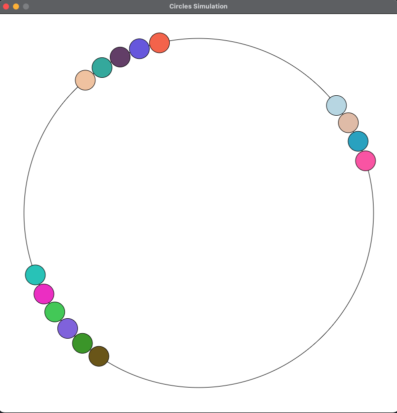

# Circular Movement Simulation
Circular movement simulation written in JavaFX. 
Each circle is a thread with random angular velocity. Circles are going in the same direction and are slowed down by other circles.

